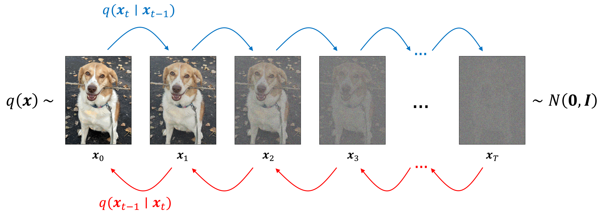
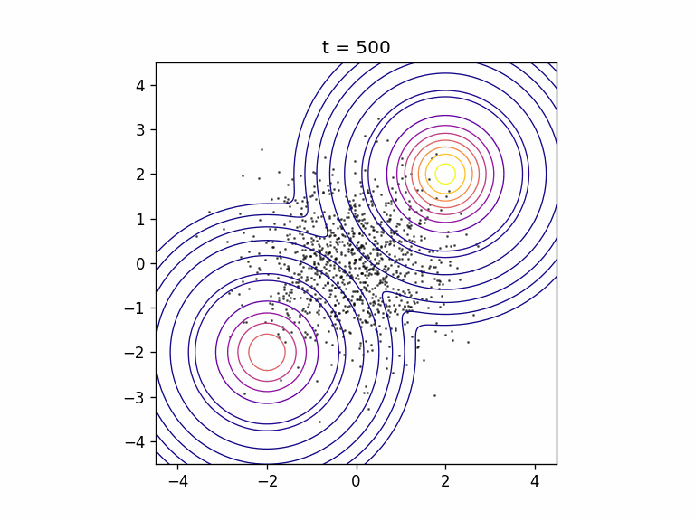

# Mini DDPM

A tiny DDPM implementation for learning a 2D Gaussian mixture distribution.

The goal is to keep the code small enough to read in one pass while still including the full DDPM loop:

- sample toy 2D data
- add noise with the closed-form forward process
- train a small MLP to predict noise
- run reverse sampling from Gaussian noise
- save the denoising process as a GIF

## Result

Forward and reverse diffusion idea:



Sampling process:



## Run

```bash
python main.py
```

For a shorter run:

```bash
python main.py --steps 3000 --num-samples 1000 --save-every 5 --gif-path sampling.gif
```

## Files

- `main.py`: simplest single-file DDPM implementation
- `ddpm.ipynb`: notebook version with derivation and experiments
- `notes/bugs.md`: notes about bugs found during implementation
- `assets/sampling.gif`: generated reverse sampling animation

## References

- https://mbernste.github.io/posts/diffusion_part1/
- https://mbernste.github.io/posts/diffusion_part2/
- https://lilianweng.github.io/posts/2021-07-11-diffusion-models/
