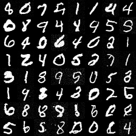
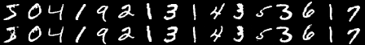
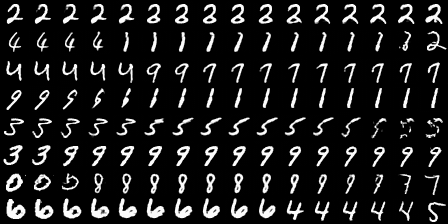
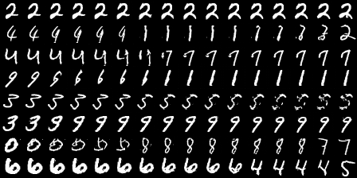

# DDIM

## Result

### Sampling

### DDIM Inversion Reconstruction

Top row: original MNIST images. Bottom row: reconstructed images after DDIM inversion and denoising.

### Latent Interpolation

Each row interpolates between two inverted MNIST latents, then denoises the interpolated latents.

linear interpolation:

slerp interpolation:

## Motivation

From the objective of DDPM, we can see that it only relies on marginal distribution $p(x_{t}|x_0)$

## Defination

We directly define the inference distribution as:

$$
q_\sigma(x_{1:T}\mid x_0)
= q_\sigma(x_{T-1}, x_{T-2}, \ldots, x_1 \mid x_T, x_0)\,
q_\sigma(x_T \mid x_0) = q_\sigma(x_T \mid x_0)
\prod_{t=2}^{T} q_\sigma(x_{t-1}\mid x_t, x_0).
$$

For $x_{t-1}$, it only depends on $x_0$ and $x_{t}$

---

We also define marginal distribution $p(x_{t}|x_0)$

$$
q_\sigma(x_T \mid x_0)
=
\mathcal{N}\left(
\sqrt{\bar{\alpha}_T}x_0,\,
(1-\bar{\alpha}_T)\mathbf{I}
\right)
$$

We defines $q_{\sigma}(x_{t-1}|x_t, x_0)$ as:

$$
q_\sigma(x_{t-1}\mid x_t, x_0)
=
\mathcal{N}\left(
mx_0
+
mx_t,
\sigma_t^2\mathbf{I}
\right)
$$

To satisfy this: 

$$
q(x_{t-1} \mid x_0)
=
\mathcal{N}\left(
\sqrt{\bar{\alpha}_{t-1}}x_0,\,
(1-\bar{\alpha}_{t-1})\mathbf{I}
\right)
$$

We get:

$$
q_\sigma(x_{t-1}\mid x_t, x_0)
=
\mathcal{N}\left(
\sqrt{\bar{\alpha}_{t-1}}x_0
+
\sqrt{1-\bar{\alpha}_{t-1}-\sigma_t^2}
\cdot
\frac{x_t-\sqrt{\bar{\alpha}_t}x_0}{\sqrt{1-\bar{\alpha}_t}},
\,
\sigma_t^2\mathbf{I}
\right)
$$

## Property

- From this inference distribution, we finally get it has the same objective as original DDPM.

- This is defination shows that we can choose different $\sigma$. And when

$$

\sigma_t
=
\sqrt{
\frac{1-\bar{\alpha}_{t-1}}
{1-\bar{\alpha}_t}
}
\beta_t

$$
 
It is as exactly same as DDPM. So DDPM is a special case of a DDIM. 

- We can set $\sigma = 0$, so the process becomes deterministic. In DDIM paper, it set:

$$
\sigma_t
=
\eta
\sqrt{
\frac{1-\bar{\alpha}_{t-1}}
{1-\bar{\alpha}_t}
}
\beta_t
$$

and, use different $\eta$ to control $\sigma$

## Accelerate Sampling Process.

We can use a another inference distribution:

$$

p_\theta(x_{0:T})
:=
p_\theta(x_T)
\prod_{i=1}^{S}
p_\theta^{(\tau_i)}
\left(x_{\tau_{i-1}} \mid x_{\tau_i}\right)
\times
\prod_{t \in \bar{\tau}}
p_\theta^{(t)}
\left(x_0 \mid x_t\right)

$$

Where, $\tau$ is a subset of $T$, and $\bar\tau$ is the rest part. It turns out that we still come to a same optimization objective. So we can use this to sampling.

## Method

We have:

$$
x_t = \sqrt{\bar\alpha_t}x_0 + \sqrt{1-\bar\alpha_t}\epsilon
$$

$$
x_0 = f(x_t) =
\frac{x_t - \sqrt{1-\bar\alpha_t}\epsilon}
{\sqrt{\bar\alpha_t}}
$$

$$
\epsilon = \frac{x_t-\sqrt{\bar{\alpha}_t}x_0}{\sqrt{1-\bar{\alpha}_t}}
$$

We can use this to reverse the distribution:

- If $\tau \neq 1$

$$
q_\sigma(x_{\tau-1}\mid x_\tau) = q_\sigma(x_{\tau-1}\mid x_\tau, f(x_\tau)) = q_\sigma(x_{\tau-1}\mid x_\tau, x_0)
=
\mathcal{N}\left(
\sqrt{\bar{\alpha}_{\tau-1}}x_0
+
\sqrt{1-\bar{\alpha}_{\tau-1}-\sigma_\tau^2}
\cdot
\epsilon,
\,
\sigma_\tau^2\mathbf{I}
\right)
$$

- If $\tau = 1$

$$
q_\sigma(x_{0}\mid x_\tau) = q_\sigma(x_{0}\mid x_1) 
=
\mathcal{N}\left( x_0, 
\sigma_1^2\mathbf{I}
\right)
= \mathcal{N}\left( \frac{x_1 - \sqrt{1-\bar\alpha_1}\epsilon}
{\sqrt{\bar\alpha_1}}, 
\sigma_1^2\mathbf{I}
\right)
$$

Of course, we do this on the subset of $\tau$

## DDIM Inversion

We can map a clean sample $x_0$ to the latent noise $x_T$.

- we set variance $\sigma_t$ to 0
- Assume we do not subsample the steps 

We know that:

- If $t \neq 1$

$$
x_{t-1}
=
\sqrt{\bar{\alpha}_{t-1}} \cdot \frac{x_t - \sqrt{1-\bar\alpha_t}\epsilon(x_t)}
{\sqrt{\bar\alpha_t}}
+
\sqrt{1-\bar{\alpha}_{t-1}}
\cdot
\epsilon(x_t),
$$

We can rewrite this: 

$$
x_t
=
\sqrt{\frac{\bar{\alpha}_t}{\bar{\alpha}_{t-1}}}x_{t-1}
+
\sqrt{\bar{\alpha}_t}
\left(
\sqrt{\frac{1}{\bar{\alpha}_t}-1}
-
\sqrt{\frac{1}{\bar{\alpha}_{t-1}}-1}
\right)
\epsilon_\theta(x_t,t)
$$

Also:

- If $t = 1$

$$
x_t
=
\sqrt{\bar{\alpha}_t}x_{t-1}
+
\sqrt{1 - \bar{\alpha}_t}
\epsilon_\theta(x_t,t)
$$

To compute $x_t$, we need to know $\epsilon_{x_t, t}$, which requires $x_t$. So we approximate $\epsilon_{x_t, t} \approx \epsilon_{x_{t-1}, t}$.

- This introduce some error.
- So the reconstruction is not exact the same.

## Reference

- [From DDPM to DDIM](https://deepschool.ai/blog/2024-02-11-DDPM-to-DDIM.html)

- https://zhuanlan.zhihu.com/p/565698027

- https://zhuanlan.zhihu.com/p/627616358
