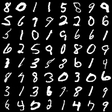
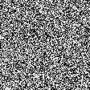

# MNIST DDPM

This is a small DDPM implementation for generating MNIST-like handwritten digit images.

The model trains a simple U-Net to predict the noise added during the forward diffusion process. After training, it starts from random noise and runs the learned reverse process to generate samples.

## Results

| Final samples | Sampling process |
| --- | --- |
|  |  |

## Run

Install dependencies with `uv`, then run from this directory:

```bash
uv run python train_mnist.py
```

For a shorter test run:

```bash
uv run python train_mnist.py --steps 1000
```

Outputs are saved by default to:

- `outputs/ckpt.pt`
- `outputs/final_samples.png`
- `outputs/sampling.gif`

To sample from an existing checkpoint:

```bash
uv run python train_mnist.py --eval-only --load-from outputs/ckpt.pt
```
